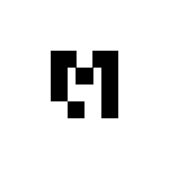

# MooseJS

MooseJS is an open source developer framework for building data & analytics applications powered by a modern data stack. Moose takes the decades-old best practices of frontend and backend developer frameworks, and brings them to your data & analytics stack.

# Getting started
To get started, check out the Moose documentation: [https://docs.moosejs.com/](https://docs.moosejs.com/)

# Community
You can join the Moose community [on Slack](https://join.slack.com/t/moose-community/shared_invite/zt-2fjh5n3wz-cnOmM9Xe9DYAgQrNu8xKxg).

Here you can get together with other Moose developers, ask questions, give feedback, make feature requests, and interact directly with Moose maintainers. 

# Made by 514
Our mission at [fiveonefour](https://www.fiveonefour.com/) is to bring incredible developer experiences to the data stack. If you’re interested in enterprise solutions, commercial support, or design partnerships, then we’d love to [chat with you](https://fiveonefour.typeform.com/signup).
