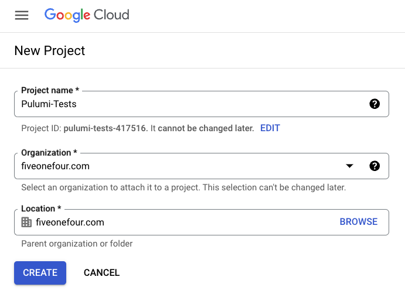

# Pulumi PoC

## Installation

https://www.pulumi.com/docs/clouds/gcp/get-started/begin/

```sh
brew install pulumi/tap/pulumi
```


## Setup
For setup we're using `TypeScript` so we need to ensure that Node is already installed locally.  Do that first before continuing.

Next ensure you have the [GCloud SDK](https://cloud.google.com/sdk/install) installed. That will allow for issuing remote gcloud commands locally.

Ensure that your local shell is setup to access your GCP project. In the example below replaced `pulumi-tests-417516` with your own project ID.

```sh
gcloud config set project pulumi-tests-417516
gcloud auth application-default login
```

Use of the pulumi cli requires a Pulumi Cloud account (which is free - but damn annoying as a first time developer experience)

Create an account here: https://app.pulumi.com/signin?reason=cli_login

Once that's done, create a personal access token at:
https://app.pulumi.com/cjus514/settings/tokens

Make sure to copy your access token and store it somewhere safe like your 1Password account.

```sh
mkdir pulumi-test && cd pulumi-test
pulumi new gcp-typescript
```



