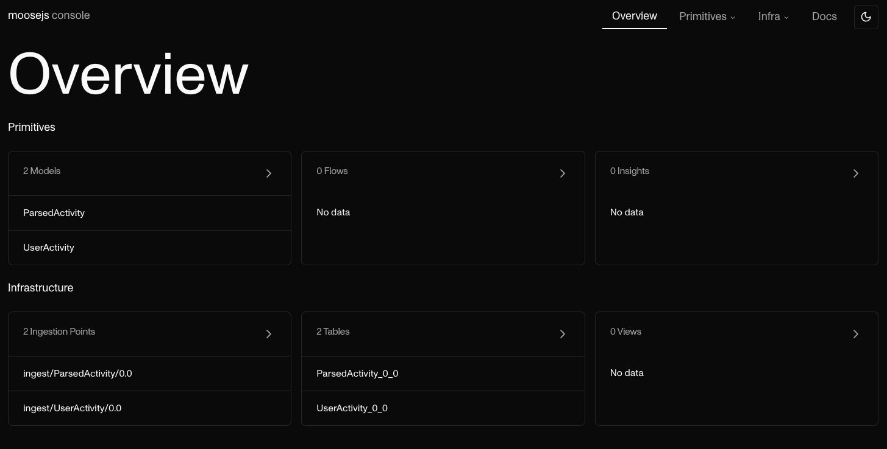

import { Callout, FileTree, Tabs } from "nextra/components";

# Walkthrough

In this walkthrough, we will cover:

- How to set up multiple versions of your Data Models in a Moose application.
- How to deprecate old versions of your Data Models

**Requirements**

- [NodeJS](https://nodejs.org/en/)
- [Docker](https://www.docker.com/)
- macOS / Linux / Windows (Using the Linux Subsystem for Windows)
- [Git](https://git-scm.com/)

## Initialize a new project

In order to start this, we will start from a blank page, this will illustrate
the concepts we are talking about and make sure we all start from the same point.

In the terminal, go to a directory where you wish to run your experiment.

```txt filename="Terminal" copy
$ cd ~
```

```bash filename="Terminal" copy
$ npx create-moose-app@latest dcm-walkthrough
```

```txt filename="Terminal" copy
$ cd dcm-walkthrough
```

At the end of the initialization process, you will have two Data Models already defined,
and the inside of your app folder should look like the following:

<FileTree>
  <FileTree.Folder name="dcm-walkthrough" defaultOpen>
    <FileTree.File name="README.md" />
    <FileTree.File name="package.json" />
    <FileTree.File name="project.toml" />
    <FileTree.Folder name="app" defaultOpen>
      <FileTree.Folder name="datamodels" defaultOpen>
        <FileTree.File name="models.prisma" />
      </FileTree.Folder>
      <FileTree.Folder name="flows" defaultOpen>
        <FileTree.Folder name="UserActivity" defaultOpen>
          <FileTree.Folder name="ParsedActivity" defaultOpen>
            <FileTree.File name="flow.ts" />
          </FileTree.Folder>
        </FileTree.Folder>
      </FileTree.Folder>
    </FileTree.Folder>
  </FileTree.Folder>
</FileTree>

When you run

<Tabs items={["No Install", "Global Install"]}>
  <Tabs.Tab>

    ```txt filename="Terminal" copy
    $ npx @514labs/moose-cli@latest dev
    ```

  </Tabs.Tab>
  <Tabs.Tab>
  
    ```txt filename="Terminal" copy
    $ moose dev 
    ```

  </Tabs.Tab>
</Tabs>

Moose will spin up a dev infrastructure for you to start building your moose app.

Go to `http://localhost:3001` from your browser. You should see the following console:



As you can see here, you have a table provisioned with the suffix `0_0` for `v0.0`
which is the default version in your package.json. Your Data Model versions
are handled by git.

## Defining a new version of the `UserActivity` Data Models

The state of your files in your git repository of your moose application corresponds to
the latest version of your data model.

With `moose` you can have multiple versions of your data model deployed at the same time. That
allows you to have loose coupling between your data infrastructure and the other parts of the
data ecosystem (such as applications that emit the data, databases you extract data from, etc...)

When you deploy a new version of your data model to be available for consumers or producers to
put data into, you can keep your old version of the data model up and running.
The two versions of a data model are linked together by a continuous data migration process.

Differently said, if data comes into your old model, the sync will bring it to your new model.

Let's see this in action.

1. Stop the dev server from running (CTRL+C)
2. With your favorite text editor, open the `app/datamodels/models.prisma` file above
3. Delete the line that says `activity` in the `UserActivity` data model, this will
   remove the activity from the data model and create a change.
4. Run the following command

<Tabs items={["No Install", "Global Install"]}>
  <Tabs.Tab>
    ```txt filename="Terminal" copy $ npx @514labs/moose-cli@latest bump-version
    ```
  </Tabs.Tab>
  <Tabs.Tab>```txt filename="Terminal" copy $ moose bump-version ```</Tabs.Tab>
</Tabs>

It will bump the version in your package.json file and add a pointer between the git commit and the previous version to the project.toml file.

```toml filename="./project.toml"
[supported_old_versions]
"0.0" = "263297f"
```

5. `$ npx @514labs/moose-cli@latest generate migrations`

This command will generate a SQL mapping file in the flows directory:

```sql filename="./app/flows/UserActivity_migrate__0_0__0_1.sql"
(eventId, timestamp, userId, activity) -> (eventId, timestamp, userId)
```

This is a SQL [fragment](https://clickhouse.com/docs/en/sql-reference/functions)
that gets embedded into two other queries:

- One that creates a trigger that continuously copies data from the older version
  to the newer version.
- One that initially loads data from the older version of the table to the newer
  version of the table.

This represents Moose's best guess at the migration path between versions,
but please feel free to edite the SQL mapping file to specify particular mapping,
typing, etc.

This file allows a user to send data to the old data model version and the new data
model version, and the data for the old version will continuously be migrated to the
new data model.

## Inspect the resulting state

Let's start by starting dev mode in the project

<Tabs items={["No Install", "Global Install"]}>
  <Tabs.Tab>

    ```txt filename="Terminal" copy
    $ npx @514labs/moose-cli@latest dev
    ```

  </Tabs.Tab>
  <Tabs.Tab>
  
    ```txt filename="Terminal" copy
    $ moose dev 
    ```

  </Tabs.Tab>
</Tabs>

Once the CLI is done processing old versions, you will be able to open the dev
console at `http://localhost:3001/primitives/models/UserActivity?tab=query`.

On this query screen, you will be able to see the additional tables automatically created for
you: `UserActivity_0_1` is one of them.

Run the following in your terminal to send some data to the v0 of your data model

```txt filename="Terminal" copy
$ curl -v -X POST \
    -H "Content-Type: application/json" \
    -d "{\"eventId\": \"1\", \"timestamp\": \"$(date '+%Y-%m-%d %H:%M:%S')\", \"userId\": \"1\", \"activity\": \"click\"}" \
    http://localhost:4000/ingest/UserActivity/0.0
```

You will notice that it contains the activity field that we deleted.

Now in the UI you can query this table by running in the query tab.

```sql copy
SELECT * FROM local.UserActivity_0_0 LIMIT 50;
```

You should see the event we just added there.

The continuous migration working behind the scenes will allow you to also see the data
inside local.UserActivity_0_1

```sql copy
SELECT * FROM local.UserActivity_0_1 LIMIT 50;
```

And now you should see the same record without the `activity`
column. The data was seamlessly migrated to the new table. This is a trivial example,
but the same feature holds true for more complex migrations.

Now if we want to set some data to the new data model version:

```txt filename="Terminal" copy
curl -v -X POST \
    -H "Content-Type: application/json" \
    -d "{\"eventId\": \"2\", \"timestamp\": \"$(date '+%Y-%m-%d %H:%M:%S')\", \"userId\": \"2\"}" \
    http://localhost:4000/ingest/UserActivity/0.1
```

The data will show up in the 0.2 table but not in the 0.1 table.
That enables you to keep old models alive with historical data as you
migrate your infrastructure to produce and consume data on the new data model.
Once all your data is migrated, you can remove the old version, and we will
appropriately clean up the infrastructure.

To summarize: the Data Change Management feature allows you to version your
data infrastructure alongside your Data Models. As you update your Data Models,
Moose will automate the creation of data infrastructure, and allow you to run the
old data infrastructure alongside the new data infrastructure, keeping the old data
flowing through to the new Data Models with migrations. Such migrations are defined
by Moose, but you may change the definition as per your requirements.
This allows you to treat your data infrastructure and your Data Models as you do your code.
