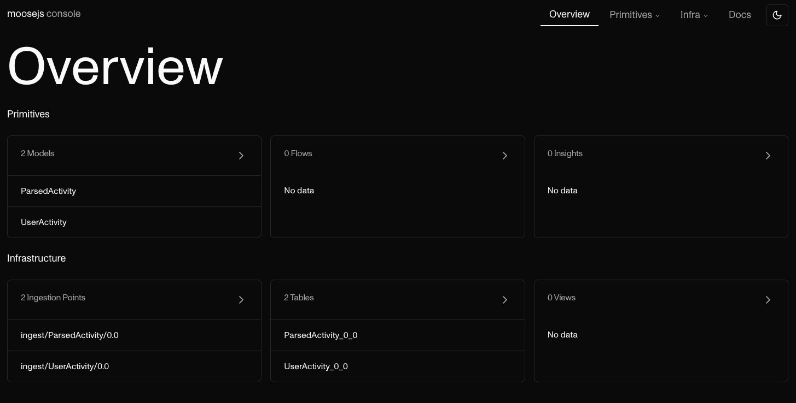

# Walkthrough

In this walkthrough we will cover:

- How to setup multiple versions of your data models in a moose application.
- How to deprecate old versions of your data models

**Requirements**

- [NodeJS](https://nodejs.org/en/)
- [Docker](https://www.docker.com/)
- macOS / Linux / Windows (Working in the Linux Subsystem)

## Initialize a new project

In order to start this, we will start from a blank page, this will illustrate the concepts we are talking
about and make sure we all start from the same point.

In the terminal, go to a direction where you wish to run your experiement.

```
$ cd ~
```

```
$ npx create-moose-app@latest dcm-walkthrough
```

```
$ cd dcm-walkthrough
```

At the end of the initialization process, you will have 2 data models already defined, and the inside
of your app folder should look like the following:

```
$ tree
.
├── app
│   ├── README.md
│   ├── datamodels
│   │   └── models.prisma
│   ├── flows
│   │   └── UserActivity
│   │       └── ParsedActivity
│   │           └── flow.ts
│   └── insights
│       ├── charts
│       └── metrics
├── package.json
└── project.toml
```

When you run

```
$ npx @514labs/moose-cli@latest dev
```

We will spin up a dev infrastructure for you to start building your moose app.

Go to `http://localhost:3001` from your browser. You should see the following console:



As you can see here, you have a table provisioned with the suffix `0_0` for `v0.0`
which is the default version in your package.json.

## Defining a new version of the `UserActivity` data models

The state of your files in your git repository correspond to the latest version of
your data model.

With `moose` you can have multiple version of your datamodel deployed at the same time. That
allows you to have loose coupling between your data infrastructure and the other parts of the
data ecosystem (application that are emiting the data, databases you extract data from, etc...)

When you deploy a new version of your datamodel to be available for consumers or producers to
put data into, you have the ability to keep your old version of the data model up and running.
The 2 versions of a data model are linked together by a contiuous data migration process.

Differently said, if data comes into your old model, the sync will bring it to your new model.

Enough talking, let's show it to you in action.

1. Stop the dev server from running (CTRL+C)
2. With your favorite text editor, open the `models.prisma` file above
3. Delete the line that says `activity` in the `UserActivity` data model
4. open the `package.json` file and change the version to be `0.1`
5. Run the following command

```
$ echo "\"0.0\"=\"$(git rev-parse --short HEAD)\"" >> project.toml
```

It will add the previous init commit to at the end of the `project.toml` file.
It should look like the following

```toml filename="./project.toml"
[supported_old_versions]
"0.0" = "263297f"
```

6. `$ npx @514labs/moose-cli@latest generate migrations`

This command will generate a sql mapping file in the flows directory

```sql filename="./app/flows/UserActivity_migrate__0_0__0_1.sql"
(eventId, timestamp, userId, activity) -> (eventId, timestamp, userId)
```

This is a mapping, record by record, that runs in the database. In dev,
as soon as you run spin up the dev server, this will be spun up and enable you
to send records to the v0.0 of you user model and those records will be seamlessly
migrated to the new version of your data model.

## Inspect the resulting state

Let's start by starting dev mode in the project

```
$ npx @514labs/moose-cli@latest dev
```

Once the cli is done processing old versions, you will be able to open the dev
console at `http://localhost:3001/primitives/models/UserActivity?tab=query`.

On this query screen, you will be able to see the additional tables we created for
you. `UserActivity_0_1` is one of them.

Run the following in your terminal to send some data to the v0 of your data model

```
$ curl -v -X POST \
-H "Content-Type: application/json" \
-d "{\"eventId\": \"1\", \"timestamp\": \"$(date '+%Y-%m-%d %H:%M:%S')\", \"userId\": \"1\", \"activity\": \"click\"}" \
http://localhost:4000/ingest/UserActivity/0.0
```

You will notice that it contains the activity field that we deleted.

Now in the UI you can query this table by running

```sql
SELECT * FROM local.UserActivity_0_0 LIMIT 50;
```

You should see the event we just added there.

Now since we setup the continuous migration in the background, we can now look at the data
inside local.UserActivity_0_1

```sql
SELECT * FROM local.UserActivity_0_1 LIMIT 50;
```

And now you should see the same record without the `activity` column. The data was seemlessly migrated to
the new table.

now if we want to set some data to the new data model version

```
curl -v -X POST \
-H "Content-Type: application/json" \
-d "{\"eventId\": \"2\", \"timestamp\": \"$(date '+%Y-%m-%d %H:%M:%S')\", \"userId\": \"2\"}" \
http://localhost:4000/ingest/UserActivity/0.1
```

The data will show up in the 0.2 table but not in the 0.1 table.
That enables you to keep old models alive with historical data as you migrate your infrastructure to produce
and consumer data on the new model. Once all your data is migrated, you can remove the old version, and we will
clean up the old version of the data.
