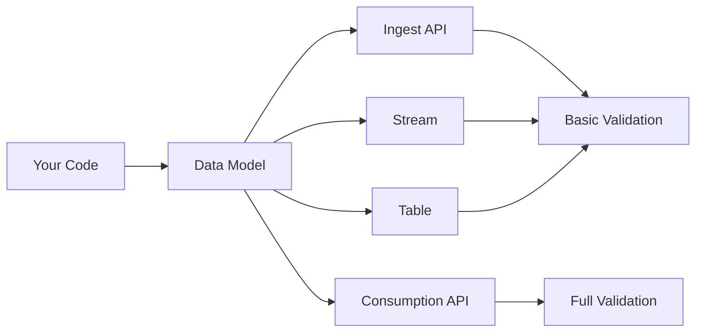

import { Callout, LanguageSwitcher, TypeScript, Python, CTACards, CTACard, CheckmarkBullets, BulletPointsCard } from "@/components";
import { FileTree, Tabs } from "nextra/components";
import { PathConfig } from "@/components/ctas";

# Data Modeling 
<LanguageSwitcher />

## Quick Start
- [Basic Data Models](#basic-data-models)
- [ClickHouse-Specific Annotations](#clickhouse-specific-annotations)
- [Validation Tiers](#validation-tiers)

---

## Core Concepts

### What is Moose Schema?

Moose Schema is a code-first approach to ClickHouse database management. Unlike traditional ORMs where your TypeScript/Python types are just hints that may or may not match your actual database schema, Moose Schema makes your code the authoritative source for your ClickHouse infrastructure.

A Moose data model defines the shape and types of your data using a single <TypeScript inline>TypeScript interface</TypeScript><Python inline>Pydantic model</Python>. Moose uses these models to generate and validate:

- **Tables** (ClickHouse OLAP tables)
- **APIs** (request/response validation)
- **Streams** (typed streaming topics)
- **Workflow Tasks** (typed function/job inputs and outputs)

**Why this is relevant:**
- Your <TypeScript inline>TypeScript</TypeScript><Python inline>Python</Python> code **IS** your database schema, not just a description of it
- Infrastructure is automatically synchronized with your code changes
- Eliminates schema drift between environments
- Provides compile-time guarantees for database operations
- Leverages ClickHouse optimizations without learning complex DDL

> **The key difference:** Traditional ORMs are database-first with disconnected types. Moose Schema is code-first with your data model as the single source of truth.

## Getting Started with Data Models

### Step 1: Super Basic Data Model

<TypeScript>
```ts
export interface ExampleModel {
  stringField: string;
  numberField: number;
  dateField: Date;
}
```
</TypeScript>

<Python>
```python
from pydantic import BaseModel
from datetime import datetime

class ExampleModel(BaseModel):
    string_field: str
    number_field: float
    date_field: datetime
```
</Python>

### Step 2: Composite Types (No Advanced Rules)

<TypeScript>
```ts
export interface CompositeExample {
  stringField: string;
  numberField: number;
  nestedObject: {
    innerString: string;
    innerNumber: number;
  };
  numberArray: number[];
  mapField: Record<string, number>;
  jsonField: Record<string, any>;
  literalField: "optionA" | "optionB";
  optionalField?: string;
  nullableField: string | null;
  dateField: Date;
}
```
</TypeScript>

<Python>
```python
from pydantic import BaseModel
from typing import Optional, List, Dict, Any, Literal
from datetime import datetime

class NestedObject(BaseModel):
    inner_string: str
    inner_number: float

class CompositeExample(BaseModel):
    string_field: str
    number_field: float
    nested_object: NestedObject
    number_array: List[float]
    map_field: Dict[str, float]
    json_field: Dict[str, Any]
    literal_field: Literal["optionA", "optionB"]
    optional_field: Optional[str] = None
    nullable_field: Optional[str] = None
    date_field: datetime
```
</Python>

### Step 3: Composite Types + Advanced Schema Rules

<TypeScript>
```ts
import { Key, ClickHouseDecimal, LowCardinality, tags } from "@514labs/moose-lib";

export interface AdvancedExample {
  id: Key<string & tags.Format<"uuid">>;
  stringField: string & tags.MinLength<2> & tags.MaxLength<64>;
  numberField: number & tags.Type<"int64">;
  decimalField: string & ClickHouseDecimal<10, 2>;
  lowCardinalityField: string & LowCardinality;
  nestedObject: {
    innerString: string;
    innerNumber: number;
  };
  namedTupleField: {
    name: string;
    value: number;
  } & ClickHouseNamedTuple;
  numberArray: number[] & LowCardinality;
  mapField: Record<string, number>;
  literalField: "optionA" | "optionB";
  optionalField?: string;
  nullableField: string | null;
  minMaxNumber: number & tags.Minimum<0> & tags.Maximum<100>;
  dateField: Date;
}
```
</TypeScript>

---

## The Complete Moose ORM Experience

Moose ORM consists of three integrated modules that work together to provide a seamless ClickHouse development experience:

### 1. **Moose Schema**: Your Code IS Your Database
- **Code-first approach**: TypeScript interfaces and Python Pydantic models become your ClickHouse table schemas
- **Zero schema drift**: Your database is always perfectly synchronized with your code
- **Native types**: No bespoke DSL—just familiar language constructs
- **ClickHouse optimizations**: Built-in support for LowCardinality, Decimal, NamedTuple, and more

### 2. **Moose Migrate**: Git-Like Infrastructure Management
- **Automatic synchronization**: No manual migration files or commands
- **Continuous diffing**: Moose constantly compares your code against your database
- **Preview changes**: See exactly what DDL will run before deploying to production
- **Rollback safety**: Understand the impact of changes before applying them

### 3. **Moose Query**: Type-Safe SQL with Autocomplete
- **Native ClickHouse SQL**: Write SQL exactly as you know it
- **Full type safety**: Compile-time validation of table and column references
- **IDE integration**: Autocomplete for all tables and columns
- **Smart aggregations**: Automatic handling of State/Merge suffixes

### How They Work Together

```typescript
// 1. Moose Schema: Define your data model
interface UserMetrics {
  userId: Key<string>;
  totalOrders: number & Aggregated<"sum", [number]>;
  averageOrderValue: number & Aggregated<"avg", [number]>;
}

// 2. Moose Migrate: Automatically creates/updates the table
// Run `moose dev` - no migration files needed!

// 3. Moose Query: Write type-safe queries
const query = sql`
  SELECT ${userMetrics.columns.userId},
         ${userMetrics.columns.totalOrders}
  FROM ${userMetrics}
  WHERE ${userMetrics.columns.averageOrderValue} > 100
`;
```

**The result**: A development experience where your code, database, and queries are always perfectly synchronized with full type safety and zero manual migration management.

---

## Data Flow Visualization



---

## Use Cases

### Modeling Your Database (`OlapTable`, `MaterializedView`, & `IngestPipeline`)

<Callout type="info" title="Moose Schema: Code-First ClickHouse ORM">
  When modeling for ClickHouse tables and views (via `OlapTable`, `MaterializedView`, or `IngestPipeline`), Moose Schema automatically maps your TypeScript/Python types to ClickHouse columns. Unlike traditional query builders where your types are disconnected from your database schema, Moose Schema makes your code the authoritative source for your table structure. In dev mode, Moose hot reloads table and view definitions as you edit your models.
</Callout>

<TypeScript>
```ts filename="app/datamodels/Order.ts"
import { Key, ClickHouseDecimal, LowCardinality, ClickHouseNamedTuple, tags } from "@514labs/moose-lib";

export interface Order {
  orderId: Key<string>; // Primary key
  amount: string & ClickHouseDecimal<10, 2>; // Decimal(10,2)
  status: string & LowCardinality; // LowCardinality(String)
  createdAt: Date; // DateTime
  customer: {
    name: string;
    address: string;
  } & ClickHouseNamedTuple; // NamedTuple
}
```
**Why Moose Schema is revolutionary:**
- **Code IS Database**: Your TypeScript interface doesn't just describe your table—it IS your table schema
- **Type Safety Everywhere**: Use these models as regular TypeScript interfaces with full type checking and autocompletion across your entire application
- **ClickHouse Optimizations**: Moose automatically applies ClickHouse-specific optimizations (like `ClickHouseNamedTuple`) when generating table schemas
- **Context-Aware**: When used outside of table contexts, ClickHouse metadata is ignored—you always get clean, regular TypeScript interfaces
- **Zero Schema Drift**: Your database schema is always perfectly synchronized with your code

**The key advantage over traditional ORMs:** Tools like Kysely provide TypeScript types that have NO underlying influence on your database schema. With Moose Schema, your TypeScript interface dictates your database table structure. No manual migration generation, no schema drift, no disconnected types.

**Example:** The `ClickHouseNamedTuple` tag lets you use `customer` as a regular TypeScript object in your business logic while Moose automatically generates the optimal ClickHouse table schema.

```ts filename="app/datamodels/Order.ts"
import { Key, ClickHouseDecimal, LowCardinality } from "@514labs/moose-lib";

export interface Order {
  orderId: Key<string>; // Primary key
  amount: number & ClickHouseDecimal<10, 2>; // Decimal(10,2)
  status: string & LowCardinality; // LowCardinality(String)
  createdAt: Date; // DateTime
}
```
</TypeScript>

<Python>
```python filename="app/datamodels/Order.py"
from moose_lib import Key, clickhouse_decimal, ClickHouseNamedTuple
from typing import Annotated
from pydantic import BaseModel
from datetime import datetime

class Customer(BaseModel):
    name: str
    address: str

class Order(BaseModel):
    order_id: Key[str]
    amount: clickhouse_decimal(10, 2)
    status: str  # Use Literal[...] for LowCardinality
    created_at: datetime
    customer: Annotated[Customer, "ClickHouseNamedTuple"]
```

**Why this is powerful:**
- Use models as regular Python objects with type checking and autocompletion
- Moose reads ClickHouse annotations (like `Annotated[Customer, "ClickHouseNamedTuple"]`) to generate correct table schemas
- ClickHouse metadata is ignored outside table contexts, giving you clean Python objects

**Single source of truth:** Define your data model once and use it everywhere—in business logic, APIs, and infrastructure. ClickHouse specific annotations are additive to your base type, and are ignored when used outside of a table context.

**Example:** The `Annotated` type lets you use `Customer` as a regular Python object while Moose generates the correct ClickHouse column type (`NamedTuple`). This enables reusing table models across your codebase—when used outside tables, the base type is used and ClickHouse metadata is ignored.

</Python>

### Dos and Don'ts for Table Modeling
- Use explicit types and ClickHouse-specific tags/annotations for columns (see summary table below).
- Avoid union types, unknown, and nullable composite types (see "Common Data Modeling Mistakes and Workarounds").
- Use LowCardinality, Enum, Decimal, DateTime64, NamedTuple, Map, etc. as needed for ClickHouse features.

<Callout type="info" title="Supported Type Annotations">
  See the summary table below for all supported types and how to annotate them for ClickHouse.
</Callout>

#### Common Data Modeling Mistakes and Workarounds

<TypeScript>
```ts filename="app/datamodels/AnyFields.ts" copy
// ❌ DO NOT: Use unknown type for flexible fields
interface BadDataModel {
  unknownField: unknown;
}
```
```ts filename="app/datamodels/AnyFields.ts" copy
// ✅ DO: Use a specific type or JSON type if truly needed
interface GoodDataModel {
  jsonField: Record<string, any>; // Only if you need to store arbitrary JSON
}
```

```ts filename="app/datamodels/FlexibleFields.ts" copy
// ❌ DO NOT: Use union types for flexible or nullable fields
interface BadDataModel {
  conditionalField: string | number;
  nullableField: string | null;
}
```
```ts filename="app/datamodels/FlexibleFields.ts" copy
// ✅ DO: Use optional fields for flexibility and nullability
interface GoodDataModel {
  conditionalString?: string;
  conditionalNumber?: number;
  nullableField?: string;
}
```

```ts filename="app/datamodels/OptionalNested.ts" copy
// ❌ DO NOT: Use Nullable with composite types (arrays, maps, nested, namedtuple)
interface BadDataModel {
  nullableNested?: {
    nestedField: string;
  };
  nullableNamedTuple?: {
    nestedField: string;
  } & ClickHouseNamedTuple;
  nullableArray?: T[];
  nullableMap?: Record<K, T>;
}
```
```ts filename="app/datamodels/OptionalNested.ts" copy
// ✅ DO: Use optional fields inside composite types
interface GoodDataModel {
  nested: {
    nestedField?: string;
  };
  namedTuple: {
    nestedField?: string;
  } & ClickHouseNamedTuple;
  array: (T | undefined)[];
  map: Record<K, T>;
}
```
</TypeScript>

<Python>
```python filename="app/datamodels/FlexibleFields.py"
# ❌ DO NOT: Use union types for flexible or nullable fields
class BadDataModel(BaseModel):
    flexible_field: Union[str, int]
    nullable_field: Union[str, None]
```
```python filename="app/datamodels/FlexibleFields.py"
# ✅ DO: Use Any for flexible fields and Optional for nullable fields
class GoodDataModel(BaseModel):
    flexible_field: Any  # Maps to JSON type in ClickHouse
    nullable_field: Optional[str]
```

```python filename="app/datamodels/OptionalNested.py"
# ❌ DO NOT: Use Optional with composite types
class BadDataModel(BaseModel):
    nested_data: Optional[NestedObject]
    named_tuple: Optional[Annotated[Coordinates, ClickHouseNamedTuple]]
    array: Optional[List[int]]
    map: Optional[Dict[str, int]]
```
```python filename="app/datamodels/OptionalNested.py"
# ✅ DO: Use Optional fields inside composite types
class GoodDataModel(BaseModel):
    nested_data: NestedObject  # with optional fields inside
    named_tuple: Annotated[Coordinates, ClickHouseNamedTuple]  # with optional fields inside
    array: List[Optional[int]]
    map: Dict[str, int]
```
</Python>

<Callout type="info" title="What we're working on next:">
- Support for default values
</Callout>

---

## Modeling APIs: Request and Response Validation

<Callout type="info" title="APIs: Type Safety at the Boundary">
  Use your data models to define the shape of data accepted by and returned from your Ingest and Consumption API endpoints. Moose validates all requests and responses at runtime, ensuring type safety and preventing schema drift.
</Callout>

<TypeScript>
```ts filename="app/datamodels/ApiRequest.ts"
export interface CreateUserRequest {
  username: string;
  email: string;
  age?: number;
}
```
</TypeScript>

<Python>
```python filename="app/datamodels/ApiRequest.py"
from pydantic import BaseModel

class CreateUserRequest(BaseModel):
    username: str
    email: str
    age: int | None = None
```
</Python>


## Modeling Streams: Typed Streaming Topics

### Stream Validation
Moose automatically validates all data published to a stream against your data model, whether via `Stream.publish(...)` or through transforms (`Stream.add_transform(...)`).

You can also manually validate data in streaming functions using `Event.model_validate(event)`.

<Callout type="info" title="Stream ↔ ClickHouse Syncing:">
If a stream's `destination` is an `OlapTable`, the stream and table must use the same data model.
</Callout>


<TypeScript>
```ts filename="app/datamodels/Event.ts"
export interface Event {
  eventId: string;
  timestamp: Date;
  payload: Record<string, any>;
}

const stream = new Stream<Event>("my-stream", {
  validateOnPublish: true  
})

// COMING SOON:
stream.addConsumer((event: Event) => {
  validate(event)
})
```
</TypeScript>

<Python>
```python filename="app/datamodels/Event.py"
from pydantic import BaseModel
from datetime import datetime
from typing import Any

class Event(BaseModel):
    event_id: str
    timestamp: datetime
    payload: dict[str, Any]

stream = Stream[Event]("stream")
stream.add_consumer(lambda event: Event.model_validate(event))
```
</Python>
---

## Modeling Workflow Tasks: Inputs and Outputs

<Callout type="info" title="Workflow Tasks: Type Safety for Function Inputs and Outputs">
  Use data models to define the input and output types for workflow tasks (functions, jobs, etc.). Moose validates task inputs and outputs at runtime using your data model.
</Callout>

<TypeScript>
```ts filename="app/datamodels/TaskInput.ts"
interface TaskInput {
  userId: string;
  action: string;
  metadata?: Record<string, any>;
}

interface TaskOutput {
  success: boolean;
  message: string;
}

const task = new Task<TaskInput, TaskOutput>("task", {
  run: async (input): Promise<TaskOutput> => {
    return {
      success: true,
      message: "Task completed successfully",
    };
  },
});
```
</TypeScript>
<Python>
```python filename="app/datamodels/TaskInput.py"
from pydantic import BaseModel
from typing import Any

class TaskInput(BaseModel):
    user_id: str
    action: str
    metadata: dict[str, Any] | None = None

class TaskOutput(BaseModel):
    success: bool
    message: str

task = Task[TaskInput, TaskOutput]("task", TaskConfig(
    run=lambda input: TaskOutput(success=True, message="Task completed successfully"),
))
```
</Python>

## Summary Table: Supported Types and Annotations

<TypeScript>
| Moose TypeScript Type                                 | ClickHouse Type             | Description                                |
|------------------------------------------------------|-----------------------------|---------------------------------------------|
| `Key\<string|number>`                                 | String, Int64 (Primary Key) | Primary key for table                       |
| `string`                                             | String                      | Text values                                 |
| `number`                                             | Float64                     | Numeric values                              |
| `boolean`                                            | Boolean                     | True/false values                           |
| `Date`                                               | DateTime                    | Timestamp values                            |
| `Array<T>`                                           | Array                       | Lists of values                             |
| `Record<K, V>`                                       | Map                         | Map of key-value pairs                      |
| `Enum`                                               | Enum                        | Enumerated values                           |
| `object` (Nested)                                    | Nested                      | Nested structures                           |
| `object & ClickHouseNamedTuple` (NamedTuple)         | NamedTuple                  | Named tuple structures                      |
| `string & LowCardinality`                            | LowCardinality(String)      | Low cardinality string                      |
| `number & tags.Type\<"int16" | "int32" | "int64">`    | Int16, Int32, UInt32, etc.  | Explicit integer types                      |
| `string & ClickHouseDecimal<P, S>`                   | Decimal(P, S)               | Decimal with precision/scale                |
| `Optional<T>`                                        | Nullable(T)                 | Optional/nullable fields (with restrictions)|
</TypeScript>

<Python>
| Moose Python Type                                    | ClickHouse Type             | Description                                 |
|------------------------------------------------------|-----------------------------|---------------------------------------------|
| `Key[str|int]`                                      | String, Int64 (Primary Key) | Primary key for table                       |
| `str`                                               | String                      | Text values                                 |
| `int`                                               | Int64                       | Integer values                              |
| `float`                                             | Float64                     | Decimal values                              |
| `Decimal`                                           | Decimal                     | Arbitrary-precision decimal                 |
| `bool`                                              | Boolean                     | True/false values                           |
| `datetime`                                          | DateTime                    | Timestamp values                            |
| `date`                                              | Date                        | Date values                                 |
| `List[T]`                                           | Array                       | Lists of values                             |
| `Dict[K, V]`                                        | Map                         | Map of key-value pairs                      |
| `Enum`                                              | Enum                        | Enumerated values                           |
| `BaseModel` (Nested)                                | Nested                      | Nested structures                           |
| `Annotated[BaseModel, ClickHouseNamedTuple]`        | NamedTuple                  | Named tuple structures                      |
| `clickhouse_decimal(p, s)`                          | Decimal(p, s)               | Decimal with precision/scale                |
| `Literal[...]`                                      | LowCardinality(String)      | Low cardinality string                      |
| `Optional[T]`                                       | Nullable                    | Optional/nullable fields (with restrictions)|
</Python>
---

## What to Do Next

### For Beginners
1. **Start Simple**: Create basic data models without ClickHouse annotations
2. **Test Your Models**: Use the validation examples to test your schemas
3. **Build a Pipeline**: Connect an IngestAPI to a Stream to a Table

### For Intermediate Users
1. **Add ClickHouse Features**: Enhance your models with type annotations
2. **Implement Validation**: Add advanced validation rules to your models
3. **Optimize Performance**: Use LowCardinality and other optimizations

### For Advanced Users
1. **Custom Validators**: Create custom validation rules
2. **Performance Tuning**: Optimize your ClickHouse table schemas
3. **Cross-Language Integration**: Ensure consistency across TypeScript/Python

---

## Common Patterns

### Time-Series Data
<TypeScript>
```ts
export interface Metric {
  id: Key<string>;
  timestamp: Date;
  value: number;
  tags: Record<string, string> & ClickHouseMap;
}
```
</TypeScript>


### User Events
<TypeScript>
```ts
export interface UserEvent {
  eventId: Key<string>;
  userId: string;
  eventType: string & LowCardinality;
  properties: Record<string, any>;
  timestamp: Date;
}
```
</TypeScript>

## The Developer Experience Revolution

### Before Moose ORM
- **Database-first approach**: Write DDL, then generate types
- **Manual migrations**: Create migration files for every schema change
- **Schema drift**: Types and database get out of sync
- **String-based queries**: No type safety, runtime errors from typos
- **Complex setup**: Multiple tools and manual processes

### With Moose ORM
- **Code-first approach**: Your TypeScript/Python code IS your database schema
- **Zero migrations**: Changes are automatically synchronized
- **Always in sync**: Impossible for code and database to diverge
- **Type-safe queries**: Compile-time validation with full autocomplete
- **Zero configuration**: Everything works together seamlessly

### Real-World Impact

**90% reduction in schema management overhead**
- No migration files to write or manage
- No manual synchronization between environments
- No schema drift debugging

**Eliminate production surprises**
- Preview exactly what will change before deployment
- Catch schema issues at compile time
- Automatic rollback safety checks

**Developer productivity boost**
- Full IDE support with autocomplete
- Type safety across your entire stack
- Focus on business logic, not infrastructure

### Get Started Today

```bash
npm install @514labs/moose-lib
# or
pip install moose-lib
```

Experience the future of ClickHouse development with Moose ORM.

---

## Related Documentation

- **[Materialized Views](../materialized-views)**: Learn about Moose Query for type-safe SQL
- **[Infrastructure Planning](../../deploying/planning)**: Understand Moose Migrate workflows
- **[Ingest APIs](../http-apis)**: Learn how to use your data models for ingestion
- **[Streaming](../streaming)**: See how data models work with streams
- **[ClickHouse Tables](../clickhouse)**: Understand table-specific modeling
- **[Workflows](../workflows)**: Use data models in workflow tasks
