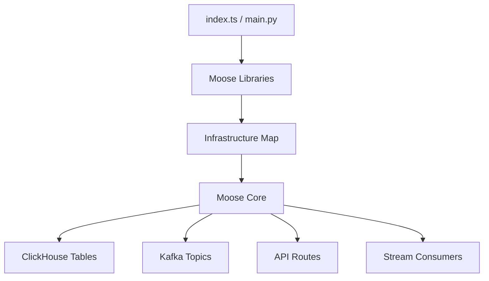

import { ZoomImg, Callout, BulletPointsCard, FeatureCards, FeatureCard } from "@/components";
import { Database, Zap, Terminal, Play, CheckCircle } from "lucide-react";
import { Tabs, Tab } from "nextra/components";

# Architecture & Design Patterns

## How Moose Fits Into Your Applications

Moose is an analytics backend framework that sits alongside your existing applications to handle data processing and analytics workloads.

### Common Integration Patterns

<div className="grid md:grid-cols-2 gap-6 my-6">
  <div className="space-y-4">
    <div className="flex items-center gap-2 mb-3">
      <Database className="w-5 h-5 text-primary" />
      <h4 className="font-semibold">Add to Existing Apps</h4>
    </div>
    <ul className="space-y-2 text-sm">
      <li>• Your app sends events to Moose APIs</li>
      <li>• Moose processes and stores analytics data</li>
      <li>• Your app queries Moose for insights</li>
      <li>• No changes to your existing database</li>
    </ul>
  </div>
  
  <div className="space-y-4">
    <div className="flex items-center gap-2 mb-3">
      <Zap className="w-5 h-5 text-primary" />
      <h4 className="font-semibold">Enhance Existing ClickHouse</h4>
    </div>
    <ul className="space-y-2 text-sm">
      <li>• Point Moose to your ClickHouse cluster</li>
      <li>• Add streaming and real-time processing</li>
      <li>• Get type-safe APIs automatically</li>
      <li>• Keep existing queries and dashboards</li>
    </ul>
  </div>
</div>

```typescript
// Your existing app sends data to Moose
await fetch('http://localhost:4000/ingest/user-events', {
  method: 'POST',
  body: JSON.stringify({
    userId: '123',
    event: 'page_view',
    timestamp: new Date()
  })
});

// Your app queries analytics from Moose
const metrics = await fetch('http://localhost:4000/consumption/user-metrics?userId=123');
```

## How Moose Works

Moose is an analytical backend framework that turns your application code into production-ready infrastructure. Think of it like Express for APIs, but for analytical data pipelines.

### Three-Layer Architecture

### 1. Your Application Code
You write business logic for data models, transformations, aggregations, and insights using Moose libraries:

```typescript
import { IngestPipeline, MaterializedView, ConsumptionApi } from '@514labs/moose-lib'

// Define data pipeline
export const events = new IngestPipeline<Event>("events", { ingest: true, stream: true });

// Define real-time aggregation  
export const metrics = new MaterializedView({
  selectStatement: "SELECT user_id, count(*) FROM events GROUP BY user_id",
  // ...
});

// Define API endpoint
export const getMetrics = new ConsumptionApi("metrics", async (params) => {
  return await client.query("SELECT * FROM metrics WHERE user_id = ?", [params.userId]);
});
```

The Moose libraries provide interfaces that wrap your logic so Moose Core can understand it - like how an ORM wraps database queries, but for analytical operations.

### 2. Moose Core
Translates your code into infrastructure. When you define:
- `IngestPipeline<Event>` → Creates ClickHouse table + Kafka topic + HTTP API
- `MaterializedView` → Creates real-time aggregation table  
- `ConsumptionApi` → Creates HTTP endpoint that queries your data

### 3. Infrastructure Layer
Specialized services that execute your analytical workloads:
- **ClickHouse**: Columnar database optimized for analytical queries
- **Kafka**: High-throughput event streaming (millions of events/sec)
- **Temporal**: Reliable workflow execution with automatic retries
- **Redis**: Fast in-memory operations

**Example Data Flow:**
```
HTTP POST /ingest/events → Kafka topic → ClickHouse table
                           ↓
MaterializedView automatically aggregates new data
                           ↓  
HTTP GET /consumption/metrics → Returns aggregated data
```

<details>
<summary><strong>Want the technical details?</strong></summary>

### How Your Code Becomes Infrastructure



**The Translation Process:**
- **Export components** from `index.ts`/`main.py` → Moose libraries compile types to JSON → Moose Core reads infrastructure map
- **IngestPipeline with schema** → Core generates `CREATE TABLE` and Kafka topics → Handles schema diffs with `ALTER TABLE`
- **MaterializedViews** → Core derives types and executes SQL → Creates tables automatically
- **Streaming functions** → Core adds Kafka consumers → Spawns processes in your local Python/Node runtime
- **Consumption APIs** → Core sets up routes → Executes your handlers in local Python/Node runtime

**Where Your Business Logic Runs:**
- **ClickHouse**: Your SQL queries and materialized view logic execute directly in the database
- **Streaming**: Your transformation functions run in local Python/Node processes managed by Moose Core
- **Workflows**: Your task code runs in local Python/Node workers orchestrated by Temporal
- **APIs**: Ingest validation runs in Rust, consumption handlers run in your local Python/Node runtime

</details>

## Development vs Production

### Local Development
When you run `moose dev`, everything runs locally with zero setup:

```bash
moose dev

# Your local stack:
# http://localhost:4000  - Your Moose APIs
# http://localhost:4002  - Metrics dashboard
# localhost:9000         - ClickHouse database
# localhost:9092         - Redpanda streaming
```

<Callout type="info" title="Safe Development">
**Zero Production Risk**: All infrastructure runs in local Docker containers. You can experiment, break things, and iterate without any risk to production systems or data.
</Callout>

### Production Deployment
- **Infrastructure**: Point Moose to your existing ClickHouse/Kafka clusters
- **Scaling**: ClickHouse and Kafka scale horizontally, Moose Core scales vertically  
- **Reliability**: Automatic retries, dead letter queues, zero-downtime migrations
- **Monitoring**: Built-in metrics for all components plus integration with your monitoring stack

## Integration Patterns

Moose sits between your data sources and consumption applications:

**Data Sources → Moose:**
- **Application APIs**: Direct HTTP ingestion from your services
- **Existing Databases**: CDC from PostgreSQL/MySQL via external services  
- **External SaaS**: Webhook endpoints or scheduled API polling
- **IoT Devices**: Direct HTTP ingestion

**Moose → Destinations:**
- **BI Tools**: Direct ClickHouse connections (Tableau, Grafana, Metabase)
- **Applications**: HTTP APIs for real-time data access
- **Data Warehouses**: Scheduled exports to Snowflake, BigQuery
- **Monitoring**: Metrics export to Datadog, New Relic


## Common Use Cases

### Real-Time Analytics Dashboard
<ZoomImg light="/Real-time-analytics.svg" dark="/ref_arch_user_facing.png" alt="Real-time analytics" />

**Pattern:** Application → Moose → Frontend Dashboard

User-facing dashboards with live metrics and operational monitoring. Your app sends events to Moose, which processes and aggregates data in real-time for frontend consumption.

### Operational Data Warehouse  
<ZoomImg light="/Data-warehouse.svg" dark="/ref_arch_op_data_warehouse.png" alt="Data warehouse" />

**Pattern:** External APIs → Moose → BI Tools

Business intelligence and historical analysis. Extract data from SaaS APIs, process in Moose, and serve to BI tools for reporting and analytics.

### Observability & Monitoring
<ZoomImg light="/Observability.svg" dark="/ref_arch_observability.png" alt="Observability" />

**Pattern:** Applications → OTEL Collector → Moose → Monitoring Tools

Application monitoring and log analytics. Collect telemetry through OpenTelemetry, process in Moose, and export to monitoring platforms.

## Next Steps

Ready to start building? Check out the [5-minute quickstart tutorial](/moose/getting-started/quickstart) or explore [complete examples](/moose/examples) to see Moose in action.
