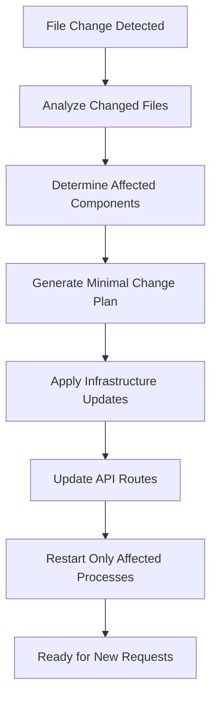

import { TypeScript, Python, LanguageSwitcher, Callout } from "@/components";

# Local Development Mode

<LanguageSwitcher />

Development mode (`moose dev`) provides a full-featured local environment optimized for rapid iteration and debugging. It automatically manages Docker containers, provides hot reload capabilities, and includes enhanced debugging features.

## Getting Started

<TypeScript>
```bash
# Start development environment
moose dev

# View your running infrastructure
moose ls

# Send test data
curl -X POST http://localhost:4000/ingest/YourDataModel \
  -H "Content-Type: application/json" \
  -d '{"field1": "value1", "field2": 123}'
```
</TypeScript>

<Python>
```bash
# Start development environment
moose dev

# View your running infrastructure
moose ls

# Send test data
curl -X POST http://localhost:4000/ingest/YourDataModel \
  -H "Content-Type: application/json" \
  -d '{"field1": "value1", "field2": 123}'
```
</Python>

## Container Management

Development mode automatically manages Docker containers for your infrastructure:

- **ClickHouse** (when `olap` feature is enabled)
- **Redpanda** (when `streaming_engine` feature is enabled)
- **Temporal** (when `workflows` feature is enabled)
- **Redis** (always enabled)

### Container Configuration

Control which containers start with feature flags:

```toml copy
# moose.config.toml
[features]
olap = true              # Enables ClickHouse
streaming_engine = true  # Enables Redpanda
workflows = false        # Controls Temporal startup
```

## Hot Reloading Development

The development runtime includes a file watcher that provides near-instantaneous feedback when you save code changes.

### Watched Files
It monitors your entire `app/` directory structure and only rebuilds the components that actually changed.

### Rebuilding

To minimize rebuild time, the file watcher only rebuilds the components that actually changed:




## Local Infrastructure

### Port Allocation

Development mode uses the following default ports:

- **4000**: Main API server (ingest and query APIs)
- **5001**: Management API (health checks, metrics, admin, OpenAPI docs)

### Service URLs

Access your development services at:

<TypeScript>
```bash
# Main application
http://localhost:4000

# Management interface
http://localhost:5001/metrics

# OpenAPI documentation
http://localhost:5001/openapi.yaml
```
</TypeScript>

<Python>
```bash
# Main application
http://localhost:4000

# Management interface  
curl http://localhost:5001/metrics

# OpenAPI documentation
http://localhost:5001/openapi.yaml
```
</Python>

### Container Networking

All containers run in an isolated Docker network with automatic service discovery:

- Containers communicate using service names
- Port mapping only for external access
- Automatic DNS resolution between services
- Network isolation from other Docker projects

## Troubleshooting

### Common Issues

**Container Startup Failures**
```bash
# Check Docker is running
docker info

# View container logs
moose logs

# Reset infrastructure
moose clean
```

**Port Conflicts**
```bash
# Check what's using your ports
lsof -i :4000
lsof -i :5001

# Use custom ports
export MOOSE_HTTP_PORT=4040
export MOOSE_MANAGEMENT_PORT=5010
moose dev
```

**Hot Reload Issues**
```bash
# Force full rebuild
moose clean && moose dev

# Check file permissions (macOS/Linux)
ls -la app/

# Disable file watching temporarily
export MOOSE_DISABLE_WATCHER=true
moose dev
```
