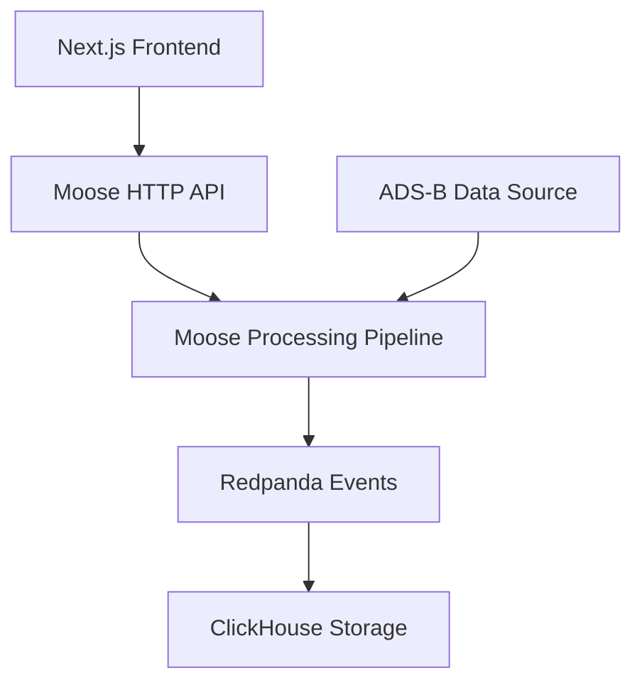

import { ZoomImg, Callout } from "@/components";
import { Button } from "@/components/ui/button";
import Link from "next/link";
import { Steps } from "nextra/components";

# Aircraft Transponder (ADS-B) Template

This template demonstrates how to build a modern full-stack application that ingests and analyzes aircraft transponder data (ADS-B) from military aircraft. It showcases a complete architecture combining a Next.js frontend with a Moose backend for real-time data processing and storage.

<Link href="https://github.com/514-labs/moose/tree/main/templates/ads-b-frontend">
  <Button variant="outline">View Source Code →</Button>
</Link>

## Architecture Overview

The template implements a modern full-stack architecture with the following components:

1. **Frontend Layer (Next.js)**
   - Modern React-based web application
   - Real-time aircraft visualization
   - Interactive data querying interface
   - Built with TypeScript for type safety

2. **Backend Layer (Moose)**
   - Data ingestion from adsb.lol API
   - Real-time data processing pipeline
   - Event streaming with Redpanda
   - Data storage in ClickHouse
   - HTTP API endpoints for frontend consumption

3. **Infrastructure Layer**
   - Redpanda for event streaming
   - ClickHouse for analytics storage
   - Temporal for workflow orchestration
   - Redis for caching
   - HTTP server for API endpoints



## Getting Started


### Prerequisites

Before getting started, make sure you have the following installed:

```bash filename="Requirements" copy
- NodeJS 20+
- Docker Desktop 24+
```

<Steps>
### Install Moose and Aurora

To get started, install Moose (open source developer platform for data engineering) and Aurora (AI data engineering product).

```bash filename="terminal" copy
bash -i <(curl -fsSL https://fiveonefour.com/install.sh) moose,aurora
```

<Callout type="info" title="Anthropic API Key">
This installation will ask for your Anthropic API key if you want to use the AI features. If you don't have one, you can follow the setup guide at Anthropic's website.
</Callout>

### Create a new project using the ADS-B template

```bash filename="terminal" copy
aurora init aircraft ads-b --mcp claude-desktop
```

### Set up the project

Navigate to the project directory and install dependencies:

```bash filename="terminal" copy
cd aircraft
npm install
```

### Start the Docker services

Make sure Docker Desktop is running, then start the Moose development server:

```bash filename="terminal" copy
moose dev
```

This will start all necessary local infrastructure including ClickHouse, Redpanda, Temporal, and the Rust ingest servers.

### Run the data ingestion workflow

Open a new terminal window and navigate to your project directory, then run:

```bash filename="terminal" copy
moose workflow run military_aircraft_tracking
```

This workflow will retrieve data from the adsb.lol military aircraft tracking API, process it according to the data model, and ingest it into ClickHouse.

</Steps>

## Explore the Data

The template allows you to explore the ingested aircraft data using AI tools like Claude Desktop or Cursor.

### Explore with Claude Desktop

Claude Desktop can help you analyze the data through natural language queries.

<Callout type="info" title="Example Questions for Claude">
Try asking Claude exploratory questions like:
- "Tell me about the data in my ClickHouse tables"
- "Tell me about the flow of data in Moose project"
- "Create a pie chart of the types of aircraft in the air right now"
- "Create a visualization of aircraft type against altitude"
</Callout>

### Productionize Your Results with Cursor

For a code-forward workflow, Cursor provides a great environment to productionize your queries.

#### Configure Cursor with Aurora MCP

```bash filename="terminal" copy
cd path/to/your/project
cursor .
```

Then run the Aurora command to configure the MCP for Cursor:

```bash filename="terminal" copy
aurora setup --mcp cursor-project
```

This will create a `/.cursor/mcp.json` file with Aurora's MCP configuration.

Enable the MCP in Cursor by going to:
`cursor > settings > cursor settings > MCP` and clicking `enable` and `refresh`.

<Callout type="info" title="Example Question for Cursor">
Try asking Cursor to help you productionize your analysis:
"Could you create an egress API that, for a given aircraft type input, returns the altitude, and longitude of each instance of that aircraft?"
</Callout>

## Project Structure

The template is organized into two main components:

```
project/
├── frontend/              # Next.js frontend application
│   ├── src/
│   │   ├── app/          # Next.js app router
│   │   ├── components/   # React components
│   │   ├── hooks/        # Custom React hooks
│   │   └── lib/          # Utility functions
│   └── package.json
│
├── moose/                # Moose backend
│   ├── app/
│   │   ├── datamodels/   # Data models for aircraft tracking
│   │   ├── functions/    # Processing functions
│   │   └── scripts/      # Workflow scripts
│   ├── moose.config.toml # Moose configuration
│   └── package.json
```

## Integration Points

The frontend and Moose backend are integrated through several key touchpoints:

1. **HTTP API Endpoints**
   - Moose exposes REST endpoints on port 4000
   - Frontend consumes these endpoints for real-time data

2. **Data Flow**
   - Aircraft data is ingested through Moose workflows
   - Processed data is stored in ClickHouse
   - Frontend queries ClickHouse through Moose API endpoints
   - Real-time updates via WebSocket connections

3. **Configuration**
   - Moose services run on preconfigured ports
   - CORS is configured for local development
   - Environment variables handle production settings

## Development Workflow

When developing with this template, you'll work with two main components:

1. **Moose Backend Development**
   - Edit data models in `moose/app/datamodels`
   - Modify processing functions in `moose/app/functions`
   - Update workflows in `moose/app/scripts`
   - Test changes with `moose dev`

2. **Frontend Development**
   - Modify React components in `frontend/src/components`
   - Update pages in `frontend/src/app`
   - Add new features using the Moose API
   - Test changes with `npm run dev`

## Production Deployment

When deploying to production:

1. **Frontend Deployment**
   - Deploy Next.js application to Vercel or similar
   - Configure environment variables for API endpoints
   - Set up proper CORS and security headers

2. **Moose Backend Deployment**
   - Deploy Moose infrastructure using Docker Compose
   - Configure production-ready Redpanda and ClickHouse
   - Set up proper monitoring and logging

## Next Steps

Once you have the data flowing, you can ask Aurora to help with any of the following:

1. Build custom visualizations of aircraft movement
2. Create alerting systems for specific aircraft types or behaviors
3. Analyze flight patterns and trends over time
4. Create APIs to surface insights from your data

Feel free to modify the data models, processing functions, or create new APIs to suit your specific needs!

