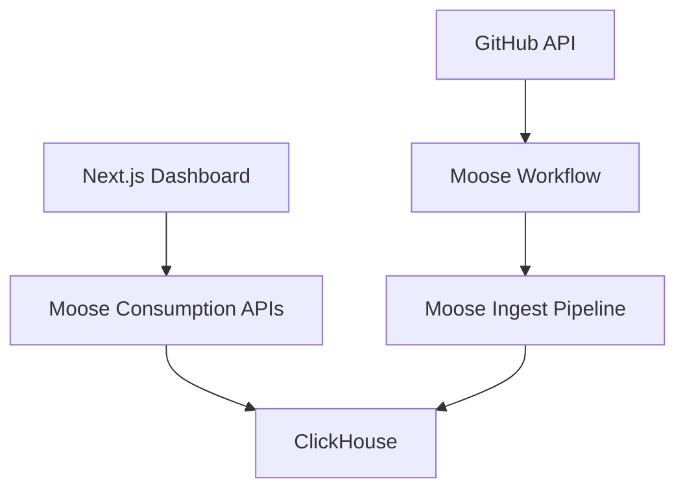

import { ZoomImg, Callout, ToggleBlock } from "@/components";
import { Button } from "@/components/ui/button";
import Link from "next/link";
import { Steps } from "nextra/components";

# Github Trending Topics

This template demonstrates how to build a real-time data pipeline and dashboard for tracking GitHub trending topics. It showcases a complete full-stack architecture that combines a Next.js frontend with a Moose backend for data ingestion, processing, and API generation.

<Link href="https://github.com/514-labs/moose/tree/main/templates/github-dev-trends">
  <Button variant="outline">View Source Code →</Button>
</Link>

## Architecture Overview

The template implements a modern full-stack architecture with the following components:

1. **Frontend Layer (Next.js)**
   - Real-time dashboard for trending topics
   - Interactive data visualization
   - Type-safe API integration with Moose Consumption APIs
   - Built with TypeScript and Tailwind CSS

2. **Backend Layer (Moose)**
   - GitHub Events data ingestion
   - Real-time data processing pipeline
   - Type-safe API generation with Moose Consumption APIs
   - ClickHouse for analytics storage

3. **Infrastructure Layer**
   - ClickHouse for high-performance analytics
   - Redpanda for event streaming
   - Temporal for workflow orchestration
   - Type-safe HTTP API endpoints



## Getting Started

<Steps>
### Clone the repository:
To get started with this template, you can run the following command:

```bash filename="terminal" copy
moose init moose-github-dev-trends github-dev-trends
```

### Install dependencies:
```bash filename="terminal" copy
cd moose-github-dev-trends/moose-backend && npm install
```

## Project Structure

The template is organized into two main components:

```
moose-github-dev-trends/
├── live-dev-trends-dashboard/    # Frontend dashboard
│   ├── app/                      # Next.js pages and routes
│   ├── components/               # React components
│   ├── generated-client/         # Auto-generated API client
│   └── lib/                      # Utility functions
│
├── moose-backend/               # Backend services
│   ├── app/
│   │   ├── apis/                # Consumption API definitions
│   │   ├── ingest/              # Data ingestion logic
│   │   ├── blocks/              # Reusable processing blocks
│   │   └── scripts/             # Workflow scripts
│   └── moose.config.toml        # Moose configuration
```

### Run the application

```bash filename="terminal" copy
moose dev
```

### Start the Workflow to Poll GitHub for Trending Topics

This workflow will run a script every 60 seconds to poll GitHub for trending topics:

```bash filename="terminal" copy
moose workflow run getGithubEvents
```

<Callout type="info" title="Scheduled Workflows">
The workflow is scheduled to run every 60 seconds. [Learn how to schedule workflows](/moose/building/workflows#scheduling-workflows).
</Callout>

### (Optional) Configure GitHub API Token

```bash filename="terminal" copy
touch .env
```

```.env filename=".env" copy
GITHUB_TOKEN=<your-github-api-key>
```

<Callout type="warning" title="API Rate Limits">
Without authentication, you're limited to 60 requests/hour. With a token, this increases to 5,000 requests/hour.
</Callout>

</Steps>

## Development Workflow


<Callout type="info" title="Modern Stack">
The visualization combines several modern technologies:
- **Moose** for type-safe API generation
- **Tanstack Query** for data management
- **Recharts** for visualization
- **shadcn/ui** for UI components
- **Tailwind CSS** for styling
</Callout>


The template demonstrates a complete integration between Moose and Next.js:

### Moose Backend

The backend is responsible for data ingestion and API generation:

```bash filename="terminal" copy
cd moose-backend && moose dev
```

Key components:
- **GitHub Event Polling**: Workflow in `app/scripts/` fetches public events and posts them to the Moose Ingest Pipeline.
- **Ingest Pipeline**: Data Model and infrastructure for ingesting GitHub Events in `app/ingest/WatchEvent.ts`
- **Consumption APIs**: Consumption APIs in `app/apis/` expose the data for the frontend

#### Start the Moose Backend
Spin up the Moose dev server:
```bash filename="terminal" copy
moose dev
```
This will automatically start the workflow that polls GitHub for trending topics and ingests the data into ClickHouse.

###  Frontend Integration

The frontend automatically integrates with the Moose backend through generated APIs:

<Steps>
#### API Client Generation
Moose generates an OpenAPI spec from your Consumption APIs that we use with [OpenAPI Generator](https://openapi-generator.tech/):
- Generated client located in `live-dev-trends-dashboard/generated-client`
- Based on OpenAPI schema from `moose-backend/.moose/openapi.yaml`

<ToggleBlock openText="Show OpenAPI Generator Command" closeText="Hide Details">
When running the following command, make sure:
- You're in the `moose-backend` directory
- The dev server is running: `moose dev`

```bash filename="Terminal" copy
cd moose-backend
openapi-generator-cli generate -i .moose/openapi.yaml -g typescript-fetch -o ../live-dev-trends-dashboard/generated-client
```

<Callout type="warning" title="When to Regenerate">
Remember to regenerate the client when you:
- Update Consumption API schemas
- Modify Ingest Pipeline definitions
- Change API endpoints or parameters
</Callout>
</ToggleBlock>

#### Data Flow & Visualization

The dashboard implements a modern data flow pattern using [Tanstack Query](https://tanstack.com/query/latest/docs/framework/react/react-query-data-fetching) and [Shadcn/UI Charts](https://ui.shadcn.com/docs/components/charts):

<ToggleBlock openText="Show API Client Setup" closeText="Hide Details">
```ts filename="lib/moose-client.ts" copy
import { DefaultApi, Configuration } from "api-client";

const apiConfig = new Configuration({
  basePath: "http://localhost:4000",
});
const mooseClient = new DefaultApi(apiConfig);

export type TopicTimeseriesRequest = ConsumptionTopicTimeseriesGetRequest;
export type TopicTimeseriesResponse = ConsumptionTopicTimeseriesGet200ResponseInner;
```
</ToggleBlock>
<ToggleBlock openText="Show Data Fetching & State Management" closeText="Hide Details">
```ts filename="components/trending-topics-chart.tsx" copy
// components/trending-topics-chart.tsx
export function TrendingTopicsChart() {
  const [interval, setInterval] = useState("hour");
  const [limit, setLimit] = useState(10);
  const [exclude, setExclude] = useState("");

  const { data, isLoading, error } = useQuery({
    queryKey: ["topicTimeseries", interval, limit, exclude],
    queryFn: async () => {
      const result = await mooseClient.consumptionTopicTimeseriesGet({
        interval,
        limit,
        exclude: exclude || undefined,
      });
      return result;
    },
  });

  // Handle loading and error states
  if (isLoading) return <LoadingSpinner />;
  if (error) return <ErrorMessage error={error} />;
}
```
</ToggleBlock>

<ToggleBlock openText="Show Interactive Visualization" closeText="Hide Details">
The dashboard creates an animated bar chart of trending topics over time:

```tsx filename="components/trending-topics-chart.tsx" copy
// Transform the current time slice of data for the chart
const chartData = data[currentTimeIndex].topicStats.map((stat) => ({
  eventCount: parseInt(stat.eventCount),
  topic: stat.topic,
  fill: `var(--color-${stat.topic})`
}));

// Render vertical bar chart with controls
return (
  <div>
    <TrendingTopicsControls
      interval={interval}
      limit={limit}
      exclude={exclude}
      onIntervalChange={setInterval}
    />
    <ChartContainer className="h-[500px]">
      <BarChart layout="vertical" data={chartData}>
        <XAxis dataKey="eventCount" type="number" />
        <YAxis dataKey="topic" width={100} />
        <Bar dataKey="eventCount" radius={[0, 4, 4, 0]} />
      </BarChart>
    </ChartContainer>
  </div>
);
```
</ToggleBlock>

#### Start the Frontend
```bash filename="terminal" copy
cd live-dev-trends-dashboard && npm install && npm run dev
```
Visit [http://localhost:3000](http://localhost:3000) to see real-time trending topics.
</Steps>

## Next Steps

Once you have the data flowing, you can:

1. Add custom metrics and visualizations
2. Implement additional GitHub data sources
3. Create new API endpoints for specific analyses
4. Build alerting for trending topic detection

Feel free to modify the data models, processing functions, or create new APIs to suit your specific needs!

