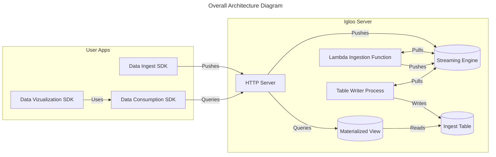
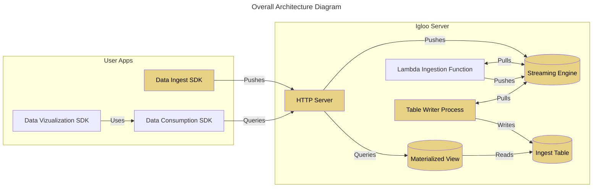

—--
authors: Nicolas Joseph <nicolas@nicolasjoseph.com>
title: Ecosystem Skeleton Architecture
state: discussion
—--

## Framework Problem Statement:

We are building an opinionated framework to enabled engineers that are building data infrastructure and pipeline to focus on the business logic and not the infrastructure. We aim at providing them with the same user experience as a front end engineer building a web application. We want to provide a framework that is easy to use, easy to maintain, easy to extend and most importantly, gives the user feedback on a code iteration immediately.

## Principles

- **Local first**: We optimize for the user experience first and we will figure out how to deploy to production later.
- **Easy to use**: We want to provide a framework that is easy to use, easy to maintain, easy to extend and most importantly, gives the user feedback on a code iteration immediately.
- **Easy to test**: We want to provide a framework that has built in unit testing from the get go.
- **Performance**: We want to provide a framework that is fast and can scale to large data sets and volumes for real life use cases.
- **Extensible**: We want to provide a framework that is easy to extend and that can be used to build a wide range of data applications.

## Architecture

### Overview

- Data Ingest SDK: The data ingest SDK is a simple library that can be embedded in the user's application to send data to an igloo deployment. It is typed with the User's Business Objects to ensure that the data sent to igloo is valid.
- Igloo Server: This is a component that abstracts away several parts of the architecture. It contains a web server that will ingest the data, a streaming engine that will store the data in streams and an OLAP Database that will store the data in a columnar format. It also runs all the code that is supplied by the user to transform the data.
- Igloo CLI: This is a command line interface that will allow the user to interact with the igloo server. It will allow the user to create a new project, run the project locally and deploy the project to a cloud provider.
- Data Consumption SDK: This SDK is typed with the user's data and allows the user to query the data from the Igloo Server. It will also allow the user to subscribe to data changes and receive updates in real time.
- Data Visualization SDK: This SDK plays well with the data Consumption SDK and contains web components of common data visualizations that can be used to build a dashboard.

### HTTP Server

The HTTP Server is a high performance API that has 2 responsabilities:

- Proxy any event it receives to the proper topic in the streaming engine
- Enable an SDK to proxy queries to any of the materielized views in the OLAP Storage layer.

In Local mode it can be the same process serving both, in a production setting, we could separate it in 2 components that are horizontally scalable independantly.

### Lambda Ingestion Function

This is a lambda function is that is provided as a hook for the user to be able to add arbitrary code to transform events that are coming from the ingest layer.

The input of the function inputs and outputs will be typed so that the user can properly encode the mapping.

The lambda function writes back to the streaming engine. To Increase throughput the instances of this function can be arbitrarily scaled horizontally.

Random idea: we could have those be state machines. In state machine mode we would not have concurrency enabled. in standard mode they could be scaled horizontally.

### Table Writer Process

This is a generic piece of code that reads anything that is written back from the ingest function to the streaming function and writes it to the corresponding table.

We could be using [vector.dev](https://vector.dev/) for this

### CLI

The igloo CLI is a tool to help the user get setup really quickly. It helps with

- Initial project setup
- Runs and configures locally the OLAP DB and the streaming engine
- Orchestrate the ingest functions and runs them
- Orchestrate the Table Writer
- Runs the API server locally
- Runs the developper console for the project

## Ingest MVP Definition

We are currently on getting an MVP of the Ingest flow in order to start dog fooding the project. Ie we want to start instrumenting igloo with igloo for usage metrics.

All the boxes in yellow below are part of the Ingest MVP

In that MVP we need the data:

- To be emitted from the instrumented app
- To Go through the web server
- Through the streaming engine
- Be written in a table on the OLAP DB
- Be Queriable in the OLAP DB through its client

A User needs to be able to:

- Iterate on the schema definition of Ingestion tables
- Create new Ingest Tables and Events
- Query the data that landed in the table
- Deploy and Iterate on the Production deployment

### Open Questions

- In Production how to we deploy everything?
- Do we provide configurations for the OLAP cluster?
- Do we provide configurations for the streaming cluster?
- Do we point the user to cloud offerings for storage to be plugged in?
- How scalable do we need the first version of this to be?
- Should we just bundle this all in one docker container?

# Appendix

## Technologies we chose

### Rust

As a high performant language we chose rust to be the glue we write that can be common across multiple user environments. Whether the user is leveraging a higher level language like Typescript or Javascript.

It is also used to build the CLI which is cross compiled for linux and macOS

### Clickhouse

Clickhouse is a high performance data storage with a small footprint. Ideal for both being deployed on the developper machine when he or she is iterating and deployed in the cloud for massive scale

### Redpandas

Red pandas is an implementation of Kafka written in C/C++. Highly performant and having a much simple operating cost than a full Kafka cluster with a Zookeeper.

### Prisma

We are using prisma files to describe tables and provision them in the olap system

## Technologies we are testing

We don't know yet if we should focus on 1 user language for implementation to start with. We are currently considering 2 languages:

### Typescript

The most ubuquitious language for building web application. It can be used on the server and in the browser after compilation. Making it a strong contender for all the web apps

### Python

This is the defacto choice of Data Science, and has a strong presence in the Data Engineering community.

## Technologies we can revist later

Some of the technologies we initially looked at.

### OLAP

- Snowflake
- BiQuery
- Pinot
- Druid
- DuckDB
- Custom
- Delta Lake
- Iceberg
- Hudi
- TiDB

### Streaming Engines

- Kafka
- NATS
