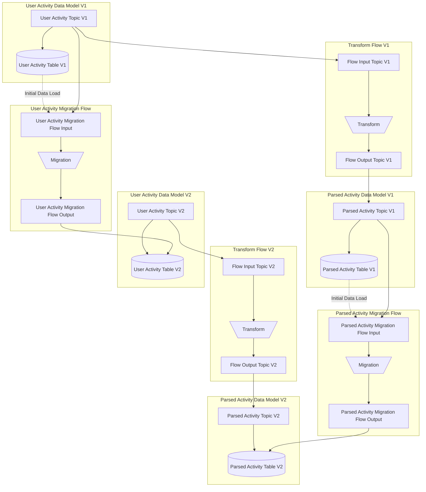

## Objective

To unify the regular flows and migration flows.

## Design Proposal

A "flow" is an input topic, an output topic, and a function that transform the values.

Note that the input topic is "owned" by the flow, not the ingestion topic (i.e. topic the ingestion point writes to).

The naming scheme is as follows: `${sourceDataModel}_{sourceVersion}_${targetDataModel}_{targetVersion}_(input|output)`

E.g. for a migration flows that moves data from `UserActivity` version 0.0 to version 0.1,
the input topic will be `UserActivity_0_0_UserActivity_0_1_input`;
for a flow that transform data from `UserActivity` to `ParsedActivity` in version 0.1,
the output topic will be `UserActivity_0_1_ParsedActivity_0_1_output`.

All records from the ingestion topic will be copied to the input topics of queues.

For regular flows, records from the output topic will be copied to the ingestion topic of the output model.\
For migration flows, the records from the output topic will be synced to the database table directly.
This is to prevent a record from `UserActivity_0_0` being both
transformed then migrated (via `ParsedActivity_0_0`) and
migrated then transformed (via `UserActivity_0_1`); thus reaching `ParsedActivity_0_1` twice.

### Alternatives Considered

Multiple flow functions can read from the ingestion topic, as reading from a topic does not consume the record.
This is in fact an often repeated benefit of Kafka logs over the traditional queues.

We have decided against it because

- Migration flows need the input topic to handle the initial load.
  - or it requires a more complicated implementation that reads from both the database and the ingestion topic.
- An input topic allows us to test only the flow without affecting other parts of the system.

### Performance Implications

This design has drawbacks on both latency and throughput.

When a flow simply reads from the ingestion topic of `UserActivity` and writes to the ingestion topic of `ParsedActivity`,
There is only one round trip from Moose to the Kafka cluster.

With the new design the data has to be

- read from the ingestion topic, copied to the input topic
- read from the input topic, transformed and written to the output topic
- read from the output topic, copied to the target topic

These extra hops between Kafka and Moose will introduce extra latency and consume more network bandwidth.

### Engineering Impact

With this proposed change the design is more uniform.
We can probably simplify the implementation
(at the cost of worse performance, as noted above).

### User Impact

The mapping between moose objects and created infrastructure
in this design should be easier to understand for users.

## Detailed Design

The following example expands upon the example flow from `UserActivity` to `ParsedActivity`.

## Questions and Discussion Topics

**Initial Data Load for Regular Flows**\
If the user wants a new flow to consume old data,
it is theoretically possible.
E.g. in the example diagram above, if flow V1 did not exist and the flow is added in V2,
we can still populate `ParsedActivity_2` from the `UserActivity_1` table
via `UserActivity_2`. This is currently unsupported.
Do we want that? How much effort will it take to support it?

In the current implementation, we pause the syncing during the initial data load.
Can we reduce the downtime?
