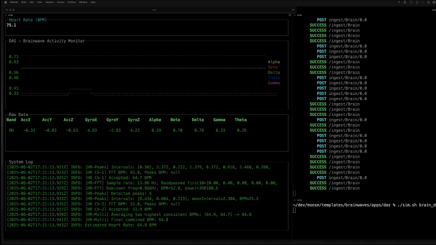

# Brainwaves

A MooseStack Application for Brainwave Data Capture & Analysis



To quickly learn about this project watch/skim through the following brief videos:

- [Video 1: Introduction and demo](https://www.youtube.com/watch?v=svrHKqcj338)
- [Video 2: Using Aurora MCP](https://www.youtube.com/watch?v=tzdQcVxJkYA)

---

## Table of Contents
1. [Project Overview](#project-overview)
2. [Quick Start Guide](#quick-start-guide)
3. [DAS: Data Acquisition Server](#das-data-acquisition-server)
4. [Brainmoose: Analytics & API](#brainmoose-analytics--api)
5. [Data Model & Analysis](#data-model--analysis)
6. [References](#references)

---

## Project Overview

**Brainwaves** is a comprehensive demo platform for brain mapping and movement analytics, built with [Moose](https://docs.fiveonefour.com/moose) and designed to work with the [Muse Headband](https://choosemuse.com) EEG device. The project consists of two main applications:

- **DAS (Data Acquisition Server):** Real-time collection, analysis, visualization, and logging of brainwave and movement data from a Muse device or simulator.
- **Brainmoose:** A Moose-powered backend for data ingestion, storage, analytics, and API access.

The platform supports both live device streaming and simulation using freely available datasets, making it ideal for experimentation, research, and educational use.

---

## Quick Start Guide

### 1. Try Without a Muse Device (Simulation)

- Download sample data and simulate device streaming:
  ```sh
  cd apps/das
  ./download.sh
  ./sim.sh brain_data_coding.csv
  ```
- **Important:** When running DAS, always provide a `--sessionId` (e.g., `npm run dev -- --sessionId=MyTestSession`) to ensure your data is grouped and identifiable in the backend.

### 2. Using a Physical Muse Device

- Connect your Muse device and configure it to stream OSC data to your computer (default UDP port: 43134).
- Start DAS with a session ID:
  ```sh
  npm run dev -- --sessionId=YOUR_SESSION_ID
  ```
- The terminal UI will display live brainwave and movement data, and all data will be logged and sent to the backend.

### 3. Start the Analytics Backend (Brainmoose)

- In a separate terminal:
  ```sh
  cd ../brainmoose
  npm install
  moose dev
  ```


### Listen to ~15 minute podcasts
> Generated using NotebookLM
- **Muse Headband Podcast**  
  [MuseHeadband.mp3](https://downloads.fiveonefour.com/moose/template-data/brainwaves/podcasts/MuseHeadband.mp3)
- **Research Using Consumer EEG Devices Podcast**  
  [ResearchUsingConsumerEEGDevices.mp3](https://downloads.fiveonefour.com/moose/template-data/brainwaves/podcasts/ResearchUsingConsumerEEGDevices.mp3)

---

## DAS: Data Acquisition Server

**DAS** is a Node.js/TypeScript application for real-time collection, analysis, and visualization of brainwave and movement data.

### Features
- Real-time UDP/OSC data ingestion from Muse or simulator
- Live terminal dashboard (charts, tables, logs)
- Session-based CSV logging
- Automatic data forwarding to Moose backend
- Relaxation and movement state analysis

### Usage
- **Simulate data:**
  ```sh
  ./sim.sh brain_data_coding.csv
  npm run dev -- --sessionId=MyTestSession
  ```
- **With device:**
  ```sh
  npm run dev -- --sessionId=YOUR_SESSION_ID
  ```

### File Structure
- `src/` - TypeScript source files
  - `main.ts` - Entry point, orchestrates server, UI, and data flow
  - `udp-server.ts` - UDP/OSC server for data ingestion
  - `display-manager.ts` - Handles terminal dashboard updates
  - `brainwave-analyzer.ts` - Analyzes relaxation and movement
  - `blessed-setup.ts` - UI layout setup
  - `logger.ts` - Colorful logging to the UI
  - `types.ts` - Type definitions for brainwave data
- `brain_data_*.csv` - Session logs of all received data
- `send-csv-to-udp.js` - Simulator script for CSV playback

### Environment Variables
- `MOOSE_INGEST_URL`: Moose backend endpoint for data ingestion
- `DAS_PORT`: UDP port to listen for incoming OSC data

---

## Brainmoose: Analytics & API

**Brainmoose** is a Moose-powered backend for ingesting, storing, and analyzing brainwave session data.

### Features
- Modular architecture for data models, serverless functions, analytics blocks, and APIs
- Ingests and stores data from DAS
- Provides APIs for querying session insights and movement scores

### Setup
- Install dependencies:
  ```sh
  npm install
  ```
- Start the backend:
  ```sh
  moose dev
  ```

### API Example
Query movement scores for sessions:
```
GET http://localhost:4000/consumption/sessionInsights?sessions=1735784964|Meditation,1735785243|Coding
```
- `sessions` parameter: Comma-separated list of `sessionId|sessionLabel` pairs.

---

## Data Model & Analysis

### Database Schema
| Field      | Type                        | Description                       |
|------------|-----------------------------|-----------------------------------|
| timestamp  | DateTime('UTC')             | Timestamp of data point           |
| bandOn     | Bool                        | Whether the band is on            |
| acc        | Nested(x, y, z) Float64     | Accelerometer data                |
| gyro       | Nested(x, y, z) Float64     | Gyroscope data                    |
| alpha      | Float64                     | Brainwave band: Alpha             |
| beta       | Float64                     | Brainwave band: Beta              |
| delta      | Float64                     | Brainwave band: Delta             |
| theta      | Float64                     | Brainwave band: Theta             |
| gamma      | Float64                     | Brainwave band: Gamma             |
| ppm        | Nested(channel1, channel2, channel3) Float64 | Photoplethysmography (PPG/PPM) data |
| sessionId  | String                      | Session identifier                |

#### Example Query (ClickHouse SQL)
```sql
SELECT
    sessionId,
    SUM(sqrt((arrayElement(acc, 1)^2) + (arrayElement(acc, 2)^2) + (arrayElement(acc, 3)^2))) AS acc_movement_score,
    SUM(sqrt((arrayElement(gyro, 1)^2) + (arrayElement(gyro, 2)^2) + (arrayElement(gyro, 3)^2))) AS gyro_movement_score,
    (SUM(sqrt((arrayElement(acc, 1)^2) + (arrayElement(acc, 2)^2) + (arrayElement(acc, 3)^2))) +
     SUM(sqrt((arrayElement(gyro, 1)^2) + (arrayElement(gyro, 2)^2) + (arrayElement(gyro, 3)^2)))) AS total_movement_score
FROM Brain_0_0
WHERE sessionId = '1735785243'
GROUP BY sessionId;
```

#### Example Movement Scores
| sessionId    | acc_movement_score | gyro_movement_score | total_movement_score |
|--------------|-------------------|--------------------|---------------------|
| 1735784964   | 96,119.65         | 773,537.96         | 869,657.61          |
| 1735785243   | 91,714.62         | 801,765.32         | 893,479.94          |

---

## References
- [Moose Documentation](https://docs.fiveonefour.com/moose)
- [Muse Headband](https://choosemuse.com)
- [osc-min Library](https://github.com/russellmcc/node-osc-min)
- [Redpanda](https://redpanda.com)
- [ClickHouse](https://clickhouse.com)
- [blessed](https://github.com/chjj/blessed)
- [blessed-contrib](https://github.com/yaronn/blessed-contrib)
- [node-fetch](https://www.npmjs.com/package/node-fetch)
- [dotenv](https://www.npmjs.com/package/dotenv)
- [yargs](https://www.npmjs.com/package/yargs)

---

For more details, see the code and comments in each app's `src/` directory.

## Community

You can join the Moose community [on Slack](https://join.slack.com/t/moose-community/shared_invite/zt-2fjh5n3wz-cnOmM9Xe9DYAgQrNu8xKxg). Check out the [MooseStack repo on GitHub](https://github.com/514-labs/moosestack).

# Deploy on Boreal

The easiest way to deploy your MooseStack Applications is to use [Boreal](https://www.fiveonefour.com/boreal) from 514 Labs, the creators of Moose.

Check out our [Moose deployment documentation](https://docs.fiveonefour.com/moose/deploying) for more details.
