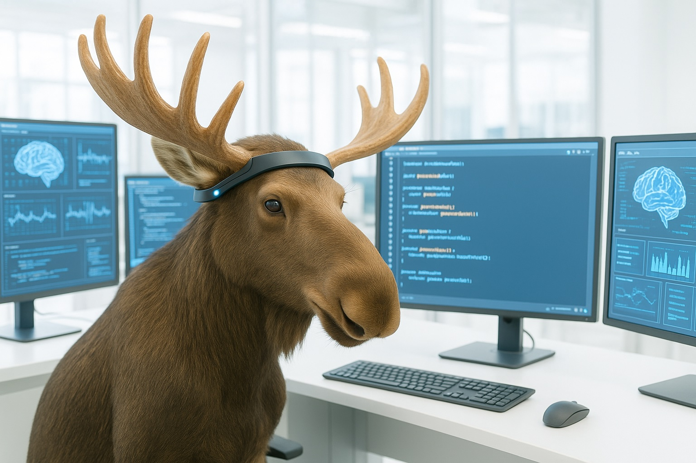

# BrainMoose

A Moose Application for Brainwave Data Capture & Analysis



---

## Table of Contents
1. [Overview](#overview)
2. [Features](#features)
3. [How It Works](#how-it-works)
4. [Getting Started](#getting-started)
5. [Data Analysis & API](#data-analysis--api)
6. [Database Schema](#database-schema)
7. [Sample Analysis](#sample-analysis)
8. [Audio Podcasts](#audio-podcasts)
9. [References](#references)

---

## Overview

**BrainMoose** is a demo application for brain mapping and movement analytics using the [Moose](https://getmoose.com) platform and the [Muse Headband](https://choosemuse.com) EEG device. It demonstrates real-time data ingestion, storage, and analysis of brainwave and movement data, with optional integration for OpenAI-powered insights.

---

## Features
- **Real-time brainwave and movement data capture** from Muse Headband
- **Data ingestion pipeline** using Moose, RedPanda, and Clickhouse
- **Movement scoring** using accelerometer and gyroscope data
- **Consumption API** for querying session insights
- **Optional OpenAI GPT-4o integration** for advanced data analysis
- **Sample analysis and podcasts** for educational purposes

---

## How It Works

1. **Data Acquisition**: The Muse Headband streams brainwave and movement data via UDP.
2. **DAS (Data Acquisition Service)**: A Node.js server (`apps/das`) receives UDP packets, parses them with [osc-min](https://github.com/colinbdclark/osc-min), and forwards them to Moose via HTTP.
3. **Data Storage**: Moose ingests the data and stores it in RedPanda (streaming) and Clickhouse (analytical DB).
4. **Analysis**: Movement scores are calculated using the Euclidean norm of accelerometer and gyroscope vectors.
5. **API & Insights**: The Consumption API exposes session movement scores for further analysis or visualization.

---

## Getting Started

### Prerequisites
- Node.js (for running Moose and DAS)
- Muse Headband device
- (Optional) OpenAI API key for GPT-4o analysis

### Setup Steps
1. **Clone the repository and navigate to the project:**
   ```sh
   cd {project_dir}/apps/brainmoose
   ```
2. **Install dependencies:**
   ```sh
   npm install
   ```
3. **(Optional) Enable OpenAI Analysis:**
   - Create a `.env.local` file in `apps/brainmoose`.
   - Add your OpenAI API key:
     ```
     OPENAI_API_KEY=your-key-here
     ```
4. **Start the development server:**
   ```sh
   moose dev
   ```

---

## Data Analysis & API

### Movement Scoring
The Muse device provides accelerometer and gyroscope data. Movement scores are calculated for each session by aggregating the magnitude of these vectors.

### Consumption API Example
Query movement scores for sessions:
```
GET http://localhost:4000/consumption/sessionInsights?sessions=1735784964|Meditation,1735785243|Coding
```
- `sessions` parameter: Comma-separated list of `sessionId|sessionLabel` pairs.
- See [`SampleAnalysis/session01.md`](SampleAnalysis/session01.md) for a sample response and analysis.

---

## Database Schema

| Field      | Type                        | Description                       |
|------------|-----------------------------|-----------------------------------|
| timestamp  | DateTime('UTC')             | Timestamp of data point           |
| bandOn     | Bool                        | Whether the band is on            |
| acc        | Nested(x, y, z) Float64     | Accelerometer data                |
| gyro       | Nested(x, y, z) Float64     | Gyroscope data                    |
| alpha      | Float64                     | Brainwave band: Alpha             |
| beta       | Float64                     | Brainwave band: Beta              |
| delta      | Float64                     | Brainwave band: Delta             |
| theta      | Float64                     | Brainwave band: Theta             |
| gamma      | Float64                     | Brainwave band: Gamma             |
| sessionId  | String                      | Session identifier                |

#### Example Query (Clickhouse SQL)
```sql
SELECT
    sessionId,
    SUM(sqrt((arrayElement(acc, 1)^2) + (arrayElement(acc, 2)^2) + (arrayElement(acc, 3)^2))) AS acc_movement_score,
    SUM(sqrt((arrayElement(gyro, 1)^2) + (arrayElement(gyro, 2)^2) + (arrayElement(gyro, 3)^2))) AS gyro_movement_score,
    (SUM(sqrt((arrayElement(acc, 1)^2) + (arrayElement(acc, 2)^2) + (arrayElement(acc, 3)^2))) +
     SUM(sqrt((arrayElement(gyro, 1)^2) + (arrayElement(gyro, 2)^2) + (arrayElement(gyro, 3)^2)))) AS total_movement_score
FROM Brain_0_0
WHERE sessionId = '1735785243'
GROUP BY sessionId;
```

---

## Sample Analysis

Example movement scores for two sessions:

| sessionId    | acc_movement_score | gyro_movement_score | total_movement_score |
|--------------|-------------------|--------------------|---------------------|
| 1735784964   | 96,119.65         | 773,537.96         | 869,657.61          |
| 1735785243   | 91,714.62         | 801,765.32         | 893,479.94          |

See [`SampleAnalysis/session01.md`](SampleAnalysis/session01.md) for a detailed breakdown and interpretation of multiple session types (Meditation, Coding, Exercise).

---

## Audio Podcasts

- **Muse Headband Podcast**  
  [MuseHeadband.mp3](docs/MuseHeadband.mp3)
- **Research Using Consumer EEG Devices Podcast**  
  [ResearchUsingConsumerEEGDevices.mp3](docs/ResearchUsingConsumerEEGDevices.mp3)

---

## References
- [Moose Documentation](https://getmoose.com)
- [Muse Headband](https://choosemuse.com)
- [osc-min Library](https://github.com/colinbdclark/osc-min)
- [RedPanda](https://redpanda.com)
- [Clickhouse](https://clickhouse.com)
