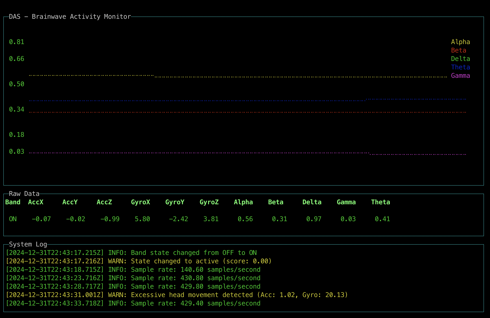

# Data Acquisition Server (DAS)

The Data Acquisition Server (DAS) is a Node.js/TypeScript application for real-time collection, analysis, and visualization of brainwave and movement data. It is designed for the Moose-powered Brain Mapping Demo, receiving data from a brainwave sensor (via UDP/OSC), displaying live metrics in the terminal, logging to CSV, and forwarding data to a Moose ingest endpoint.



## Quick Start: Simulate Device Data (Recommended for Most Users)

Most users will not have access to a physical Muse device. You can still experience the DAS dashboard by simulating real-time data streaming using the provided `send-csv-to-udp.js` script. This tool reads a `brain_data*.csv` file and sends each row as a series of OSC messages over UDP, mimicking a real device.

### Why Use This?
- **Demo and test DAS** without hardware
- **Replay previously captured sessions** for analysis or demonstration

### Usage

1. Ensure you have Node.js installed.
2. In one terminal, start DAS as usual:
```sh
   npm run dev
```
3. Download sample brainwave datasets:
```sh
   ./download.sh
```
4. In another terminal, run the simulator:
```sh
   ./sim.sh brain_data_coding.csv
```
The DAS dashboard will display the streamed data as if it were coming from a real device.

---

## Using DAS with a Physical Muse Device (Advanced/Optional)

If you have access to a real Muse headband or compatible brainwave device, you can use DAS to capture and visualize live data.

### Setup

1. Connect your Muse device and ensure it is streaming OSC data to your computer's network interface.
2. Configure the Muse device or bridge software to send OSC packets to the DAS UDP port (default: 43134).
3. Start DAS:
   ```sh
   npm run dev -- --sessionId=YOUR_SESSION_ID
   ```
4. The terminal UI will launch, showing live brainwave data, movement, and logs. Data is saved to `brain_data_<sessionId>.csv` and sent to the Moose backend.

---

## Features
- **Real-time UDP/OSC data ingestion** from brainwave headbands or similar devices
- **Live terminal dashboard** with charts and tables for brainwave and movement data
- **Session-based CSV logging** for offline analysis
- **Automatic data forwarding** to a Moose backend via HTTP
- **Relaxation and movement state analysis** with visual and log feedback

## How It Works
1. **UDP Server**: Listens for OSC-formatted UDP packets containing brainwave and movement data.
2. **Data Processing**: Parses incoming data, updates the live dashboard, and analyzes for relaxation and excessive movement.
3. **Logging & Forwarding**: Appends each data point to a session-specific CSV file and POSTs it to the Moose ingest endpoint.
4. **Terminal UI**: Uses [blessed](https://github.com/chjj/blessed) and [blessed-contrib](https://github.com/yaronn/blessed-contrib) for a live dashboard with:
   - Line chart of brainwave bands (Alpha, Beta, Delta, Theta, Gamma)
   - Table of latest raw sensor values
   - System log panel for state changes and warnings

## Setup

### Prerequisites
- Node.js (v18+ recommended)
- TypeScript

### Install dependencies
```sh
npm install
```

### Build the project
```sh
npm run build
```

### Configure environment variables
Create a `.env.local` file in the project root with:
```ini
MOOSE_INGEST_URL="http://localhost:4000/ingest/Brain"
DAS_PORT=43134
```
- `MOOSE_INGEST_URL`: Moose backend endpoint for data ingestion
- `DAS_PORT`: UDP port to listen for incoming OSC data

## File Structure
- `src/` - TypeScript source files
  - `main.ts` - Entry point, orchestrates server, UI, and data flow
  - `udp-server.ts` - UDP/OSC server for data ingestion
  - `display-manager.ts` - Handles terminal dashboard updates
  - `brainwave-analyzer.ts` - Analyzes relaxation and movement
  - `blessed-setup.ts` - UI layout setup
  - `logger.ts` - Colorful logging to the UI
  - `types.ts` - Type definitions for brainwave data
- `brain_data_*.csv` - Session logs of all received data
- `send-csv-to-udp.js` - Simulator script for CSV playback

## Dependencies
- [node-fetch](https://www.npmjs.com/package/node-fetch)
- [dotenv](https://www.npmjs.com/package/dotenv)
- [osc-min](https://www.npmjs.com/package/osc-min)
- [blessed](https://www.npmjs.com/package/blessed) & [blessed-contrib](https://www.npmjs.com/package/blessed-contrib)
- [yargs](https://www.npmjs.com/package/yargs)

## Stopping the Server
- Press `q`, `ESC`, or `Ctrl+C` in the terminal to gracefully shut down.

## License
MIT
